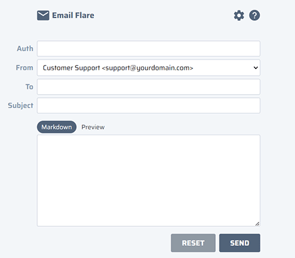
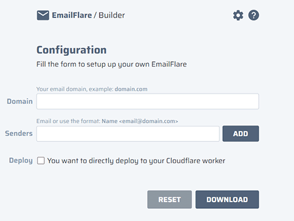
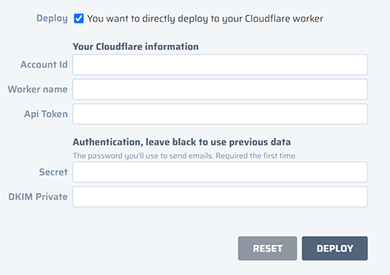

# EmailFlare ✉️✨

>
> **Note**
> Follow me on [@giuseppelt](https://twitter.com/giuseppelt) where I publish updates and collect feature requests and issues
>

>
> **Note**
> A full tutorial on how to copy and setup your own EmailFlare for your domain is available at [blog post](https://www.breakp.dev/blog/email-flare-send-from-worker-for-free/)
>


## What is EmailFlare?
**EmailFlare** allows you to send emails from your own domain through Cloudflare for free.

As open-source MIT-licensed software, you can host your own EmailFlare on your domain and keep everything in control.

It provides:
- a simple email composer
- markdown support to enrich text with simple formatting, links ...
- configurable sender list, ex: **hello**@domain.com, **contact**@domain.com, ...
- auto deploy on your Cloudflare account
- you can host it on https://**email**.domain.com (subdomain configurable)



## Builder
EmailFlare provides a [simple builder](https://emailflare.breakp.dev/builder) to create your own EmailFlare and download the code.

You don't need to clone the repo, build, customize and run anything. Just use the UI configurator and click the _Download_ button to get the code.



You'll get a single `worker.js` file. You can manually deploy it on your Cloudflare account. Follow the instruction on the [tutorial article](https://www.breakp.dev/blog/email-flare-send-from-worker-for-free/#manual-deploy).

## Auto Deploy
You can directly deploy your own EmailFlare for your domain. Use the **Auto Deploy** feature, and deploy EmailFlare on your own Cloudflare worker, with a handy wizard.

.

You need to fill the _Authentication_ section only the first time. Or, if you want change your password, you can type a new one in the _Secret_ field.

More details available on the [tutorial article](https://www.breakp.dev/blog/email-flare-send-from-worker-for-free/#auto-deploy).


## Sending emails is Free?
Cloudflare and MailChannels made a partnership to allow sending email from workers for free. [Announcement](https://support.mailchannels.com/hc/en-us/articles/4565898358413-Sending-Email-from-Cloudflare-Workers-using-MailChannels-Send-API).

So, inside a Cloudflare you can call the MailChannels API and send email for your domain.

**EmailFlare** makes all this easy for you. It offers a web UI where you can compose emails and the _code_ that runs in a worker to actually send them. You only have to deploy you own EmailFlare to your Cloudflare account.

## How it works?
**EmailFlare** is full-stack app (SPA + API) bundled in a single-file worker. It's easy to deploy a single file, you can just drag-and-drop it on the Cloudflare dashboard, or use the **Auto-Deploy** feature provided by the EmailFlare builder page.

As a fullstack webapp, EmailFlare includes both the client side — the UI — and server side — the API. Both sides are packaged and bundled together in a single-file worker.

A single worker acts for the two sides. It delivers the static assets — UI, scripts, images, fonts, … — to the browser. And, it responds to API calls.

>
> **Important**
> EmailFlare is just an experiment on how you can deploy and serve a full webapp with a single worker, on the edge, or on a FaaS solution. This is a first step in a more advanced scenario I will show in the future. Follow [@giuseppelt](https://twitter.com/giuseppelt).
>


## Repository organization
This is a monorepo managed by pnpm. This _single worker_ experiment has a very defined _concern_ separation. A webapp and an API, clearly isolated.

There're 3 packages:
- **app** - the client side
- **api** - the server side
- **worker** - build scripts, bundler and worker environment tester

### App
The App is a very simple SPA app. It's built with preact, a lightweight alternative to React. The App itself is a single component [App.tsx](/packages/app/src/App.tsx).

Remember when they say _"organize your app and split it in small components"_? Yeah, sometimes there's a need for transgression.

The App is full static. Just assets. The App talks to the API side with standard HTTP requests via fetch.

To run the App:
```
> cd packages/app
> pnpm dev
```

### API
The EmailFlare server side is a _Json-API_. It's build with [httpc](https://github.com/giuseppelt/httpc), which allows to create APIs as function calls in an RPC-like fashion. With **httpc** you can use a typed client to ensure end-to-end type safety with typescript powered clients.

For now, the API expose a single call `sendEmail`. In the future, the API will be expanded to include personalization and state.

To run the API:
```
> cd packages/api
> pnpm dev
```

### Worker
The worker package contains scripts file to actually build your own version of EmailFlare with your configuration.

The bundling is done with [bun](https://bun.sh), with some black magic. Bun features import macros. The script imports all assets as _inline_ resources at _bundle-time_ inside the worker code.
```
> pnpm build:bun
```

If you don't have bun on your system, an alternative is to build with [esbuild](https://github.com/evanw/esbuild).
```
> pnpm build:esbuild
```

The build script assumes both the App and API are already built. So before calling the _build_ script for the worker, just call the _build_ for both the App and API.

The build produces a single `index.bundle.js` inside the `dist` folder.

Once built, you can test if the worker works. You can simulate a local workers environment.
```
> pnpm dev:bundle
```

## Contributing
EmailFlare is open source and developed on [this repository](https://github.com/giuseppelt/emailflare). Every contribution is welcome, from error reporting to feature request.

Or, if you just want to discuss about it, feel free to head to open a issue and write your thoughts.

## License
MIT (c) 2023 [Giuseppe La Torre](https://breakp.dev)
